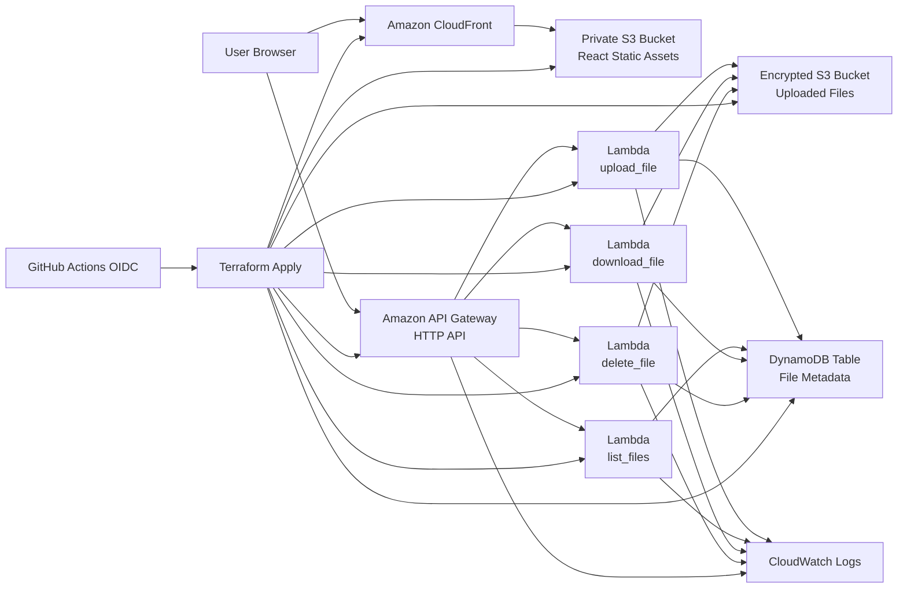

# CloudVault Cloud Architecture

CloudVault is a serverless file management platform with a React frontend and an AWS-native backend.

## Architecture Diagram



## Components

- React, Vite, Tailwind CSS frontend in `frontend/`
- API client in `frontend/src/services/api.js`
- Frontend static hosting through private S3 and CloudFront Origin Access Control
- API Gateway HTTP API with configurable CORS
- Python 3.12 Lambda functions for upload, list, download, and delete
- S3 bucket for uploaded files with encryption, versioning, blocked public access, and HTTPS-only policy
- DynamoDB table for file metadata with on-demand billing, encryption, and point-in-time recovery
- CloudWatch log groups for API Gateway and Lambda functions
- GitHub Actions CI/CD using AWS OIDC credentials

## Request Flows

### Upload

1. Browser reads the file and sends JSON to `POST /files/upload`.
2. API Gateway forwards the request to `upload_file`.
3. Lambda validates file name, MIME type, and size.
4. Lambda writes the object to the encrypted S3 uploads bucket.
5. Lambda stores metadata in DynamoDB.
6. Frontend refreshes the file list.

### List

1. Browser calls `GET /files`.
2. API Gateway invokes `list_files`.
3. Lambda scans DynamoDB and returns file metadata.

### Download

1. Browser calls `GET /files/{id}/download`.
2. Lambda reads metadata from DynamoDB.
3. Lambda returns a temporary S3 pre-signed URL.
4. Browser opens the pre-signed URL to download directly from S3.

### Delete

1. Browser calls `DELETE /files/{id}`.
2. Lambda loads metadata from DynamoDB.
3. Lambda deletes the S3 object.
4. Lambda removes the DynamoDB metadata record.

## CORS

CORS is configured in Terraform through:

```hcl
cors_allowed_origins = ["https://your-cloudfront-domain.cloudfront.net"]
```

For early development, the default is `["*"]`. For production, set exact origins:

- CloudFront URL, for example `https://d111111abcdef8.cloudfront.net`
- Custom application domain, for example `https://cloudvault.example.com`
- Local development origin only when needed, for example `http://localhost:5173`

The same values are passed into Lambda environment variables so JSON error responses also carry compatible CORS headers.

## CI/CD Deployment

The workflow `.github/workflows/cloudvault-ci-cd.yml` does the following:

1. Runs Python unit tests.
2. Installs frontend dependencies.
3. Lints and builds the React app.
4. Runs `terraform fmt -check` and `terraform validate`.
5. Applies Terraform on pushes to `main`.
6. Captures Terraform outputs for API Gateway, S3, and CloudFront.
7. Runs CORS and upload/list/download/delete smoke tests.
8. Builds React with `VITE_API_URL`.
9. Uploads static assets to the frontend S3 bucket.
10. Invalidates CloudFront.

Required GitHub secrets:

- `AWS_ROLE_TO_ASSUME`
- `AWS_REGION`

Optional GitHub repository variable:

- `CORS_ALLOWED_ORIGINS`: HCL list, for example `["https://cloudvault.example.com"]`

## Manual Deployment

Deploy infrastructure:

```bash
cd backend/terraform
terraform init
terraform apply -var="aws_region=us-east-1"
```

Capture outputs:

```bash
API_URL=$(terraform output -raw api_endpoint)
FRONTEND_BUCKET=$(terraform output -raw frontend_bucket_name)
DISTRIBUTION_ID=$(terraform output -raw frontend_cloudfront_distribution_id)
```

Build frontend:

```bash
cd ../../frontend
VITE_API_URL="$API_URL" npm run build
```

Upload assets:

```bash
aws s3 sync dist/ "s3://$FRONTEND_BUCKET" --delete --exclude "index.html" --cache-control "public,max-age=31536000,immutable"
aws s3 cp dist/index.html "s3://$FRONTEND_BUCKET/index.html" --cache-control "no-cache,no-store,must-revalidate" --content-type "text/html"
aws cloudfront create-invalidation --distribution-id "$DISTRIBUTION_ID" --paths "/*"
```

## Smoke Tests

Run against a deployed API Gateway URL:

```bash
cd frontend
API_URL="https://your-api-id.execute-api.us-east-1.amazonaws.com" npm run smoke:cors
API_URL="https://your-api-id.execute-api.us-east-1.amazonaws.com" npm run smoke:api
```

`smoke:api` uploads a small text file, verifies it appears in `GET /files`, downloads it with a pre-signed URL, checks the content, and deletes it.

## Production Checklist

- Replace wildcard CORS with exact CloudFront or custom-domain origins.
- Use GitHub OIDC instead of long-lived AWS keys.
- Keep S3 public access blocked for both frontend and uploads buckets.
- Serve frontend only through CloudFront HTTPS.
- Use `frontend_domain_aliases` and `frontend_acm_certificate_arn` for a custom domain before public launch. The ACM certificate must be in `us-east-1` for CloudFront.
- Keep `force_destroy_bucket=false` for production.
- Monitor Lambda errors, API Gateway 5xx responses, and CloudFront error rate in CloudWatch.
- Consider adding authentication with Cognito or another identity provider before storing user-private files.
